# 🔩Duplicate Character Remover

<table>
    <p align="center">
        <a href="https://duplicate-character-remover.vercel.app">
            
        </a>
    </p>
    <h3 align="center">Duplicate Character Remover</h3>
    <p align="center">A tool that can help you remove duplicate characters from your text with ease.</p>
    <p align="center">
        <a href="https://duplicate-character-remover.vercel.app">View Demo</a>
    </p>
</table>

<!-- TABLE OF CONTENTS -->

# 🛒Table of Contents

- [About The Project](#about-the-project)
  - [Showcase](#showcase)
  - [Built With](#built-with)
  - [Features](#features)
- [How to run](#how-to-run)
- [Basic Structure of the Project](#basic-structure-of-the-project)

<!-- ABOUT THE PROJECT -->

## 📞About The Project

It is designed to be fast, efficient, and easy to use. Simply paste your text into the input box, click the "Next" button, and the webapp will instantly take a new page where you can select the duplicate character. The processed text can then be displayed in a text box or copied to the clipboard for further use.

## 📸Showcase

<table align="center">
    <tr>
        <td align="center">
            <a href="https://duplicate-character-remover.vercel.app">
                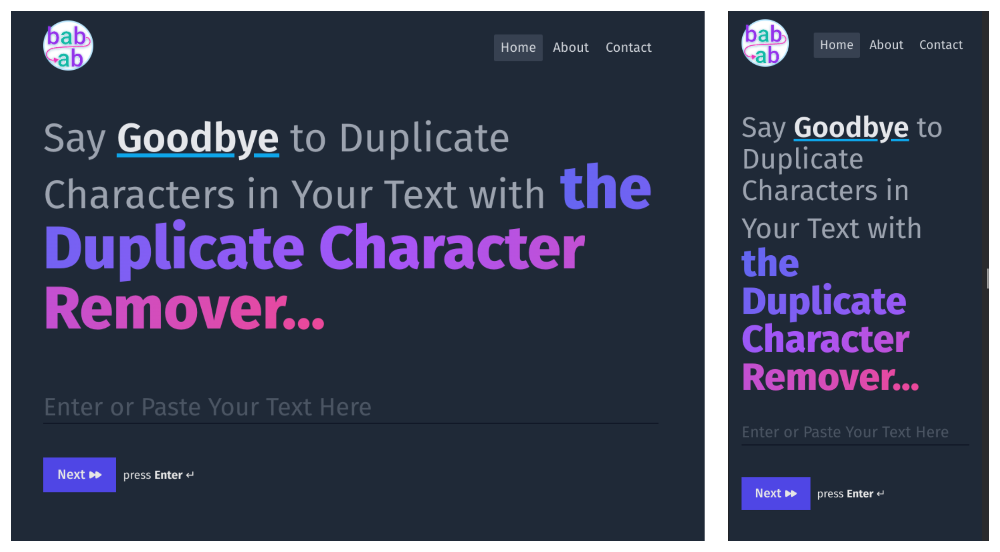
                Home Page
            </a>
        </td>
    </tr>
    <tr>
        <td align="center">
            <a href="https://duplicate-character-remover.vercel.app/abacbabd">
                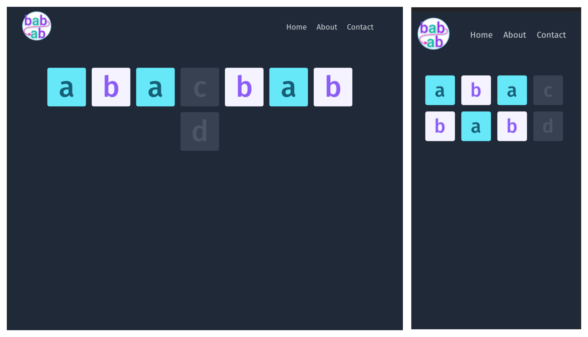
Remove Duplicate Page
            </a>
        </td>
    </tr>
    <tr>
        <td align="center">
            <a href="https://duplicate-character-remover.vercel.app/contact">
                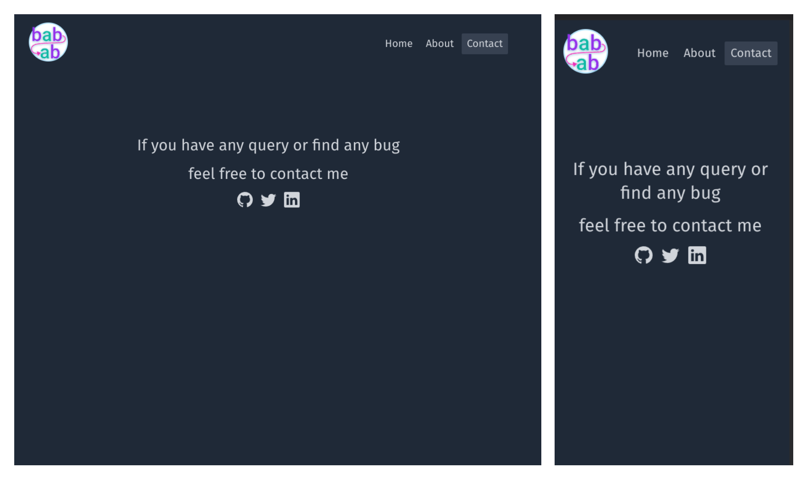
Contact Page
            </a>
        </td>
    </tr>
</table>

## 🛠Built With


## ♨Features

### Home Page


<details>
    <summary>
        If the Input Field is empty, show toast <b>"😔 can't process empty string"</b>
    </summary>

- <table align="center">
        <tr>
            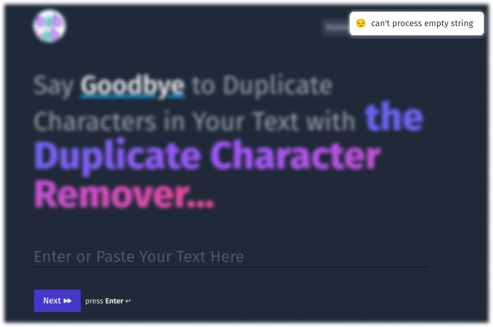
        </tr>
    </table>
</details>

<details>
    <summary>
        If Input Field has only space characters, show toast <b>"😮‍💨 can't process white space only"</b>
    </summary>

- <table align="center">
        <tr>
            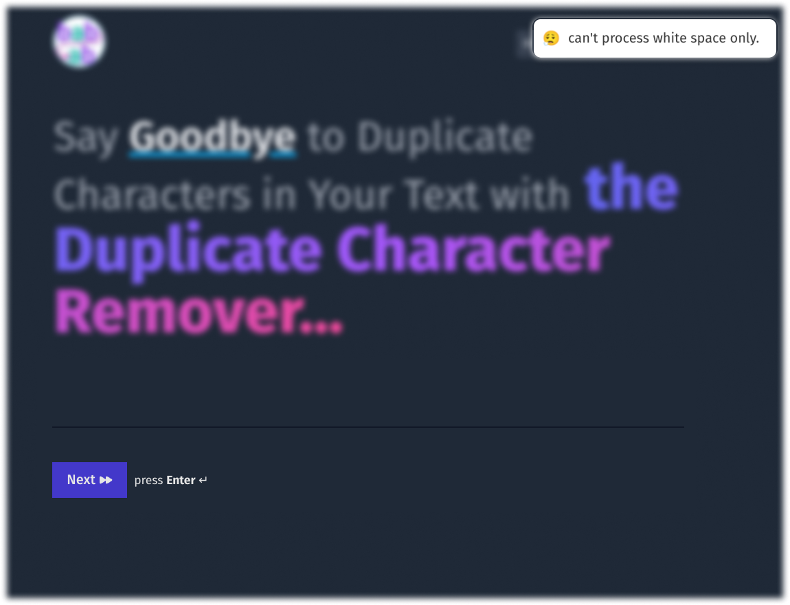
        </tr>
    </table>
</details>

<details>
    <summary>
        If Input Field <b>contain</b> space characters, show a Modal
    </summary>
   
- <table align="center">
        <tr>
            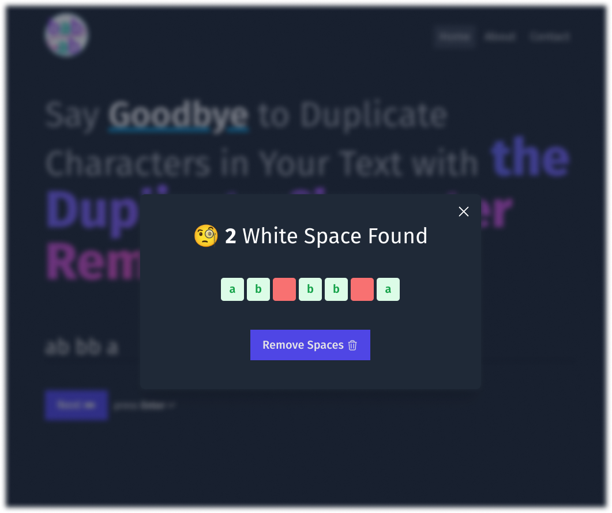
            <p align="center">warning Modal screenshot input contain white space</p>
        </tr>
    </table>


- <table align="center">
        <tr>
        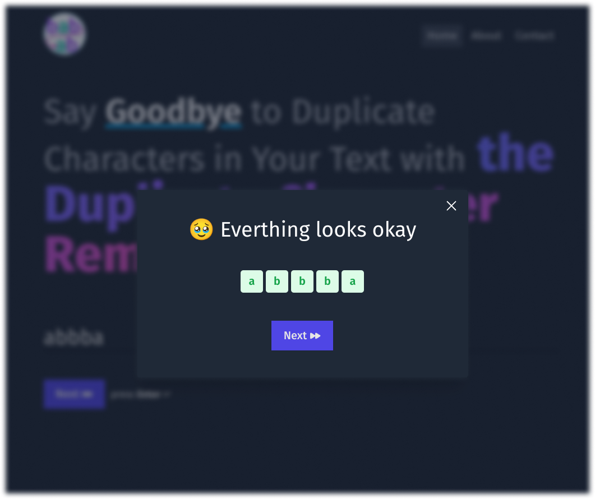
    <p align="center">Modal screenshot after removing the white space</p>
        </tr>
    </table>
</details>

### Remove Duplicate Page

<details>
    <summary>
        Cards for the same characters have same background color <code>Tailwind colors only</code>
    </summary>

 - `TailwindCSS` provides 50 to 900 color shade, so Here used a light dark combination `50-500` `100-600` `...` `400-900`. Randomly choose from this color only.

 - <table align="center">
    <tr>
        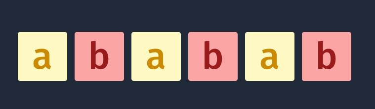
    </tr>
    </table>

- character `'a'` have two shade **background-color** `light``yellow-100` `#FEF9C3` and **color** `dark` `yellow-600` `#CA8A04`
- character `'b'` have two shade **background-color** `light` `red-300` `#FCA5A5` and **color** `dark` `red-800` `#991B1B`
- `Fuction` can be found here [getCharacterWiseRandomColors](src/utils/getCharacterWiseRandomColors.ts) and `colors` object [colors](src/data/colors.ts)
</details>

<details>
    <summary>
        Only selected character is <code>Highlighted</code>
    </summary>

- <table align="center">
        <tr>
            
        </tr>
    </table>

- Here we can see only selected character `a` Highlighted
</details>

<details>
    <summary>
        <code>Disabled</code> UI card if not duplicate present of a particular character
    </summary>

- <table align="center">
        <tr>
            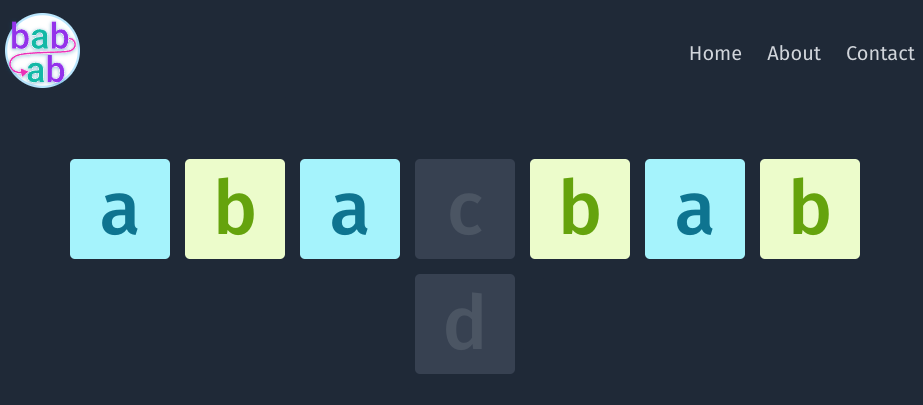
        </tr>
    </table>

- Here we can see character `c` and `d` have no duplicate
</details>

<details>
    <summary>
        <code>Delete</code> all duplicate instances of the chosen character in the string and only the clicked instance of the character remains on the screen
    </summary>

- <table align="center">
        <tr>
            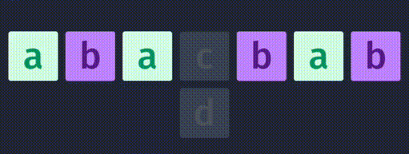
        </tr>
    </table>

- here we selected character `a` at index of `5` after click remain a character instance removed the new index of `a` become `3`
</details>

<details>
    <summary>
        <code>Key Board</code> support
    </summary>

- `RightArrow` for select right character chard.
- `LeftArrow` for select left character chard.
- `Enter` for remove duplicate.
</details>

<details>
    <summary>
        <code>Successfully</code> Removed Duplicate Modal
    </summary>

- <table align="center">
        <tr>
            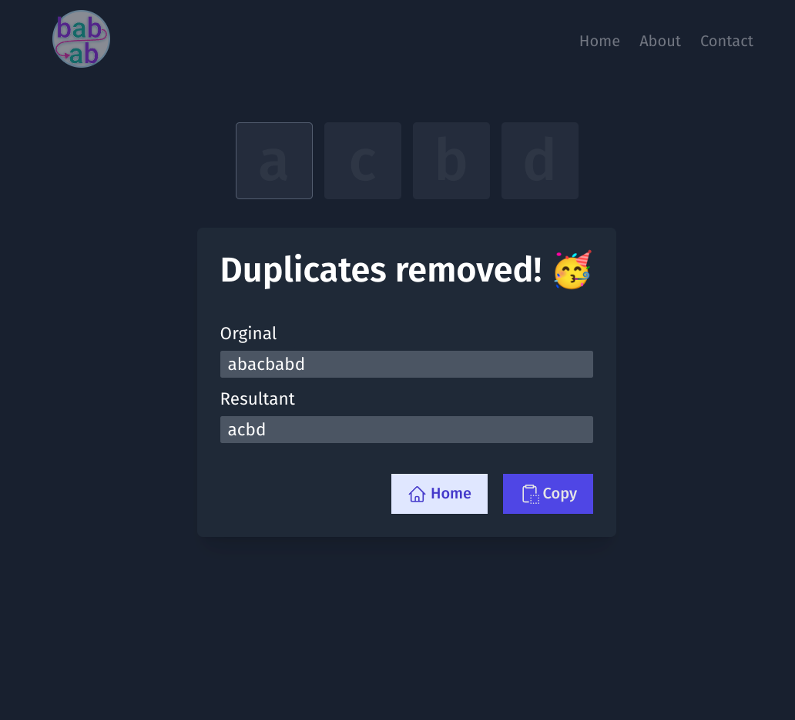
        </tr>
    </table>

- We can see the original string and resultant string in the Modal.
- `Home` button to go back to the home page.
- `Copy` button to copy the resultant in the system Clipboard.
</details>

## 🏃How to run

1. Make sure you have installed [pnpm](https://pnpm.io/installation)

2. Install the dependencies

    ```bash
    pnpm i
    ```

3. Start the dev server
    
    ```bash
    pnpm dev
    ```

This will start the project at http://localhost:3000/


## 👷‍️Basic Structure of the Project

```
    |
    |- .gihub             # github action files
    |- .husky             # Husky Config file
    |- public             # Any files within this directory will not be processed by Webpack but copied directly to the build folder.
    |- readme             # Contains all helper file for the README.md
    |- src:               # Contains all source code for the React application.
        |
        |- assets
        |- components     # Contains all the components used within the app.
        |- data           # Contains all the data.
        |- features       # separate features.
        |- hooks          # custom react hooks store here.
        |- Layout         # page layout define here.
        |- pages          # Contains all the pages of the app.
        |- routes         # config differenet routes here.
        |- styles         # Contains custom css files.
        |- types          # Contains typescript types.
        |- utils          # Contains all helper functions
        |- App.js
        |- index.js
```

## 🙏 Thank You